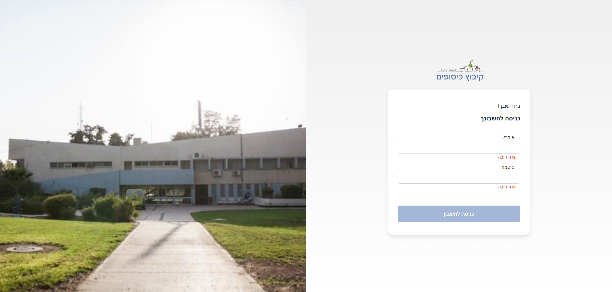

# Kibbutz Kissufim — Community Messages App

A React web app built after October 7th to help the evacuated Kibbutz Kissufim community collect, organize and search the important messages that flooded their WhatsApp groups after the move to a Dead Sea hotel — turning an endless chat stream into clear, browsable categories.

Built as a pilot by a volunteer team, in collaboration with the AppleSeeds (Tapuach) nonprofit (two senior developers and a senior product manager accompanied the project). Covered by *Yediot HaNegev*.

> Part of a 3-tier system: [Backend API](https://github.com/amirg76/kehilapp-backend) · **User App (this repo)** · [Admin Dashboard](https://github.com/amirg76/kehilapp-admin)

### Tech Stack

**Client**
- React + Vite
- Tailwind CSS
- Redux Toolkit (state management)
- React Query (data fetching & caching)
- React Router (routing)
- Quill (rich-text editing)

**Server** ([kehilapp-backend](https://github.com/amirg76/kehilapp-backend))
- Node.js + Express (REST API)
- MongoDB + Mongoose
- Joi (validation), Multer (file uploads)
- AWS EC2 (dev & prod) with CI/CD

### Contributors
- Amir Gilboa — full-stack
- Dafna Bashan
- Samir Khoury

### Status
Pilot — built with a volunteer team, not taken to production.

---
© Amir Gilboa
